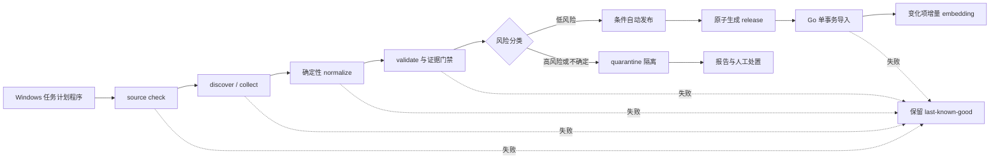

# P11 数据获取与发布管道设计

> 状态：已完成；下一步进入 P12 价格观察。最后更新：2026-08-24。
>
> 产品范围与阶段顺序见[阶段 2 总纲](../product/stage2.md)，所有适配器、自动任务和人工操作必须遵守[数据获取与发布规则](../data/数据获取与发布规则.md)。此前的[数据获取方式探查](../data/2026-08-23-数据获取方式探查.md)仅保留为历史调研记录，不代表当前实施路线。

## 1. 设计结论

P11 采用“本机定时、文件留痕、条件发布、数据库投影”的方案。Windows 任务计划程序负责在开发电脑开机时按期启动管道；低风险且证据完整的变化可以自动发布，高风险变化进入隔离区。任何失败都保留上一份可用数据，不以空值、旧页面误解析或低质量来源覆盖正式数据。

“自动”不等于“已经在线部署”：

- 电脑开机且网络、Docker、PostgreSQL 可用时，任务按计划执行。
- 电脑关机时任务不会执行；任务配置为“错过计划后尽快运行”，下次开机补采。
- P11 不要求域名、服务器或 24 小时在线。以后如需关机期间持续采集，再把同一 CLI 搬到 NAS、服务器或受控 CI runner。
- GitHub Actions 不能直接更新只存在于本机 Docker 的数据库，因此不作为当前主调度器。

常规定时运行禁止调用大模型。模型只允许在人工显式启动的离线候选辅助中使用，不能作为定时任务依赖、事实来源或发布裁决者。

### 当前实现边界（2026-08-24）

已经实现：

- `sources.registry.json` 及 registry/run/evidence/review/release 五份 JSON Schema。
- `pcdata source/collect/normalize/review/publish/bootstrap/health/scheduled-run` CLI。
- ETag/Last-Modified、robots、响应大小、登录/验证码、401/403/429 等 HTTP 安全门禁。
- 运行幂等键、文件互斥锁、checkpoint、机器 Diff、风险分类和 quarantine。
- 不可变 release、`current.json` last-known-good、审核后漂移检查和失败不切换。
- `00007_p11_data_pipeline.sql` 与 `00008_p11_closeout.sql`，以及 parts、publication、evidence 的 Go 单事务导入。
- Windows 定时任务安装/卸载、隐藏运行、Compose 健康检查和登录后补跑脚本。
- AMD 13 个 CPU SKU 的固定官方型号页映射、精确身份解析和 65 条字段 evidence。
- release artifact v2、`catalog_state` 显式导入、`partial` run 和数据库 checkpoint 可观测投影；历史 v1 release 继续兼容。
- Python 143 项测试；自动测试使用 fake HTTP，不访问真实来源或模型。
- 已在保留数据卷的真实 PostgreSQL 上迁移到版本 8，完成 160 SKU bootstrap、AMD v2 发布、run/publication/evidence 记录。
- 已安装正式五项 Windows 任务；两次一次性 Task Scheduler 验收均成功并自动清理。

明确边界：P11 只维护 AMD CPU 既有 SKU 的规格与证据，不发现新 SKU、不采集价格；NVIDIA 自动页面采集因其条款限制而排除。电脑关机期间仍不会运行，正式公网 runner 不属于本阶段。

操作方式见[P11 本机数据任务](../ops/P11本机数据任务.md)。



## 2. 设计目标与非目标

### 2.1 目标

- 在本机无人值守完成来源检查、增量采集、确定性标准化、校验、风险分类和安全发布。
- 每个正式关键字段可追溯到来源 URL、采集时间、原始哈希和适配器版本。
- 正常无变化运行不改文件、不写数据库、不重算 embedding。
- 低风险变化无需逐批人工点击；异常变化不会污染正式数据。
- 任务可重入、可补跑、可恢复，并能明确区分“未运行”“采集失败”“已隔离”“已发布”。
- 继续兼容现有 JSONL、价格 CSV 和 Go 导入命令。

### 2.2 非目标

- 不建设全站爬虫、浏览器机器人或数据管理 Web 后台。
- 不绕过登录、验证码、robots、限流、风控或服务条款。
- 不承诺实时电商价格、库存或 24 小时在线更新。
- 不接入京东联盟 API；此前调研结果仅作历史记录。
- 不让大模型定时浏览、定时抽取或直接写正式数据。
- 不在 P11 引入 Intel 平台、新品类或公共产品 API 变化。

## 3. 现有实现复用

| 现有能力 | P11 处理 |
|---|---|
| `sources.lock.json` 锁定 git commit/PyPI 版本 | 保留，扩展为来源锁、适配器版本和采集配置的机器输入 |
| `pcdata.pcpart.fetch_snapshot` 下载八类 JSONL | 保留为锁定版本候选适配器；定时任务只检查版本，不静默升级 lock |
| `catalog/*.json` 记录 selection/override/ref/note | 保留为 seed 和人工例外入口，新增字段级 evidence 引用 |
| `merge_specs` 固定来源优先级 | 保留确定性合并；冲突转入 quarantine，不静默覆盖 |
| `canonical.py` 严格字段校验 | 继续作为候选和正式数据共同门禁 |
| `coverage.py` 检查八类恰好 20 条 | 改为按 `catalog_state` 和阶段目标检查 |
| `parts/*.jsonl` | 保留为 Git 中的 bootstrap 数据；自动运行产生独立 release artifact |
| `cmd/importparts` | 保持 CLI 兼容，作为自动发布的数据库事务边界 |
| `cmd/importprices` | P12 保持旧 CSV 兼容，并导入价格观察选出的不可变快照 |
| `cmd/embedparts` 全量重算 | P14 增加指纹后支持增量；仍保留显式全量模式 |

P11 不复制 canonical schema，也不让 Python 和 Go 各维护一套关键字段定义。若运行时需要目录状态，先做数据库迁移，再同步 Python 产物信封和 Go 严格解码器。

## 4. 文件布局与数据权威

建议布局：

```text
scripts/data/
  sources.registry.json       # 来源身份、许可、频率与可信等级
  sources.lock.json           # 精确版本、端点和适配器锁
  catalog/                    # Git 中的 seed 与人工 override
  evidence/                   # 可提交的短证据索引
  parts/                      # Git 中的 bootstrap canonical JSONL
  prices/                     # Git 中的 bootstrap 价格快照
  schemas/                    # registry/run/evidence/review/release schema
  work/                       # gitignore：候选、原始响应和临时报告
    runs/<run_id>/
      manifest.json
      raw/
      normalized/
      review.json
      review.md
    quarantine/<run_id>/
      decision.json
      review.md
var/data/                     # gitignore：本机自动管道持久状态
  checkpoints/                # ETag、Last-Modified、游标和上次成功时间
  releases/<release_id>/      # 不可变正式发布包
  current.json                # last-known-good release 指针
  scheduler/                  # 任务锁、最近运行和补跑状态
```

权威边界如下：

- Git 管理代码、schema、来源规则、seed 数据和人工 override。
- `var/data/releases` 中带哈希的不可变 release 是本机自动运行的发布事实；PostgreSQL 是当前 release 的运行时投影。
- 自动任务不执行 `git add`、`git commit` 或 `git push`，避免后台修改代码仓库。
- 可按月把稳定 release 摘要或经过筛选的数据快照人工归档进 Git，但这不是日常发布的前置条件。
- `current.json` 只在 release 文件写完、全部门禁通过且数据库事务成功后原子切换。

原始网页、API 响应和人工模型输出可能包含受限内容或临时标识，默认只保存在忽略目录并按保留期清理。仓库和 release 只保存 URL、哈希、最短证据摘要、适配器版本和裁决结果。

## 5. 核心数据结构

### 5.1 来源登记 `sources.registry.json`

每个来源至少包含：

```json
{
  "id": "amd_products",
  "kind": "official_catalog",
  "adapter": "amd_cpu_official",
  "base_url": "https://www.amd.com",
  "purpose": ["discovery", "spec"],
  "trust_tier": "A",
  "license_or_terms_url": "https://www.amd.com/en/legal/terms-and-conditions.html",
  "requires_credentials": false,
  "automated_access": "allowed_after_review",
  "robots_policy": "obey",
  "rate_limit_policy": "weekly_serial_one_request_per_second",
  "schedule": "weekly",
  "failure_mode": "isolate_source",
  "resources_path": "amd-cpu-products.json",
  "enabled": true
}
```

来源未登记、条款未检查、自动访问状态为 unknown、要求凭据但未配置，均不得执行网络采集。`enabled=true` 前必须保存首次条款检查时间和适配器负责人；后续条款或 robots 变化自动禁用该来源并进入 quarantine。

### 5.2 运行 manifest

每次调度创建 UUID `run_id`，固定记录：

- `schema_version`、`run_id`、触发方式、开始/结束时间、主机匿名指纹。
- 是否为开机补跑、原计划时间、任务版本和互斥锁结果。
- 来源 ID、锁定版本、适配器版本和命令参数。
- HTTP 状态、ETag、Last-Modified、内容哈希、采集结果和安全错误分类。
- 候选条数、失败条数、隔离条数、重试次数和发布决定。
- `model_used`；常规定时任务必须为 `false`。
- 不记录 API Key、Cookie、Authorization、完整模型 prompt 或受限页面正文。

### 5.3 字段证据

正式关键字段必须关联 evidence ID：

```json
{
  "id": "ev_gpu_gb_5070_length_20260823",
  "sku": "gpu-gb-5070-windforce-sff",
  "field": "length_mm",
  "value": 282,
  "source_id": "gigabyte_official",
  "source_url": "https://www.gigabyte.com/.../sp",
  "captured_at": "2026-08-23T10:00:00+08:00",
  "raw_sha256": "...",
  "method": "deterministic",
  "evidence_excerpt": "Card size ... 282 mm",
  "evidence_status": "verified"
}
```

定时主链只接受 `method=deterministic`。人工运行可以产生 `model_assisted` 候选，但必须进入 quarantine，不能由同一次运行自动晋级。证据摘要只保留核验所需的最短文本。

### 5.4 发布 manifest

每次发布固定绑定：

- 输入 run ID、上一 release ID 和新 release ID。
- catalog、parts、prices、styles、evidence 的输入/输出 SHA-256。
- 新增、修改、状态变化和退休数量。
- 关键字段变化、价格异常、证据缺口和隔离项。
- 风险规则版本、`auto|manual` 发布决定及逐项理由。
- 数据库事务结果、embedding 结果和 `current.json` 切换结果。

删除或退休不能通过“文件消失”表达；必须是显式状态变化并保留原因和上一值。

## 6. CLI 与一次调度的执行方式

统一入口建议为 `uv run --project scripts/data pcdata <command>`；在完成 packaging entry point 前可继续使用 `python -m pcdata.<module>`。

### 6.1 命令

- `source check [--live]`：校验登记、锁、条款状态和凭据。`--live` 仅做无副作用的最小连通性检查。
- `discover`：发现官方目录新增/下架候选，只写 `candidate`。
- `collect`：使用条件 GET 增量采集到运行目录；403、401、429、验证码、登录页或条款变化立即停止该来源。
- `normalize`：只运行确定性适配器。名称模糊匹配、页面结构不确定或字段冲突均进入隔离区。
- `review`：稳定生成 JSON/Markdown Diff、证据覆盖和风险分类。
- `publish --policy auto|manual`：复核输入哈希，在临时目录构建 release，并在成功后原子导入和切换。
- `health`：检查数据年龄、证据覆盖、来源状态、待隔离队列和 last-known-good 一致性。
- `scheduled-run --profile weekly|monthly --catch-up`：单一编排入口，串联检查、采集、校验、风险分类和条件发布。

人工离线辅助可使用独立命令或 `normalize --allow-model`，但必须满足：

- 不被 `scheduled-run` 调用。
- 输出强制进入 quarantine。
- 明确记录 provider、model、schema 版本和原始证据位置。
- 后续只有确定性规则复核或人工批准才能发布。

### 6.2 自动发布条件

一个批次只有同时满足以下条件才能 `--policy auto`：

1. 所有来源已启用、条款状态有效，采集未出现登录、验证码、403、429 或页面结构异常。
2. 所有 SKU 完成精确身份匹配；不存在品牌、容量、颜色、后缀、修订版或 part number 歧义。
3. 所有变化都有可定位 evidence，且由确定性适配器产生。
4. 关键字段不存在来源冲突；canonical、coverage、规则 golden 和导入预检全部通过。
5. 没有隐式删除、跨品类移动、异常空值增长或批量退休。
6. 价格变化在允许范围内且商品变体完全一致；P12 实现前价格不参与网络自动更新。
7. 输入哈希与 review 一致，目标 release 尚不存在，数据库中无另一活动发布。
8. 运行全程 `model_used=false`。

新 SKU 只有在 A 级具体型号来源、关键字段全部完整、身份精确且价格满足核心池新鲜度时，才可自动进入 `active_core`。否则最多自动进入 `catalog_only`；证据不完整或身份不确定时只保留为 `candidate`。

### 6.3 必须隔离的变化

以下任一情况不得覆盖上一正式值：

- 已有 SKU 的 socket、内存代际、尺寸、TDP、供电接口、额定功率等兼容关键字段改变。
- A 级来源与其他来源冲突，或官方同页出现两个无法解释的值。
- 价格相对上一快照变化超过 25%，或同批多个 SKU 出现异常同幅变化。
- 隐式删除、单批退休超过 5%、大量字段突然为空或页面模板明显变化。
- 型号只能模糊匹配、页面需要登录/验证码、robots 或条款状态变化。
- 任何模型参与、解析器异常容错或人工临时 override。

隔离不会阻塞其他来源和其他 SKU 的低风险批次，但同一个 SKU 必须保持 last-known-good，直到有新的安全发布决定。

## 7. 本机调度与恢复

### 7.1 Windows 任务计划程序

P11 提供 PowerShell 包装脚本和可导入的任务模板，推荐计划：

| 任务 | 计划 | 行为 |
|---|---|---|
| 数据健康检查 | 每天 03:30 | 不采集，只检查年龄、来源和发布一致性 |
| 核心规格/价格更新 | 每周一 04:00 | 执行 weekly profile；P12 前只更新已实现来源 |
| 失败来源重试 | 每周三 04:00 | 只重试可安全重试的幂等 GET，不绕过限流 |
| 新 SKU 发现 | 每月 1 日 04:30 | 执行 monthly profile，新项先进入 candidate |
| 开机补跑 | 系统启动后延迟 5 分钟 | 仅补最近一次错过的计划，不追跑全部历史任务 |

任务属性固定为：

- “如果错过计划，尽快启动”。
- “如果任务已运行，不启动新实例”。
- 使用项目绝对路径，不依赖交互式 shell 的当前目录。
- 启动前检查 Docker Compose 的 `postgres` 服务和数据库迁移状态；`redis` 仅用于可选通知，不阻塞数据发布主链。
- 发布使用 PostgreSQL advisory lock；文件层再使用独占锁，双重防止并发。
- 每次任务有硬超时；超时只标记 run 失败，不切换 release。
- 日志写入本机忽略目录并按天轮转，不弹出含凭据的窗口。

### 7.2 开机补跑语义

- 本机 `var/data/checkpoints` 文件是单机调度恢复权威；`source_checkpoints` 仅同步 `last_attempt_at`、`last_success_at` 和状态作为数据库可观测投影，不参与调度竞争。
- 补跑只在上次成功早于最近一个应执行时间时触发。
- 同一 `scheduled_for + profile` 具备幂等键；重复启动返回原 run 或安全结束。
- PostgreSQL 不可用时可以完成纯网络采集并保存候选，但禁止发布；数据库恢复后再从固定输入哈希继续。
- Redis 不作为数据发布真值；Redis 不可用只影响可选运行通知，不影响检查点和发布事务。

### 7.3 将来迁移到在线 runner

CLI、manifest、advisory lock 和 release 协议不能依赖 Windows 专有语义。未来可把同一命令迁移到 NAS、服务器或 CI，但需要另外解决长期凭据、到本地数据库的网络连接、持久 release 存储和告警；P11 不假装已经具备这些条件。

## 8. 数据库演进建议

P11 推荐新增一次迁移，但不修改产品 API DTO：

1. `parts.catalog_state`：`active_core|catalog_only|retired`。
2. `parts.spec_fingerprint`：canonical specs 与证据版本的稳定哈希。
3. `data_job_runs`：计划时间、触发方式、状态、错误分类和输入/输出哈希。
4. `source_checkpoints`：来源游标、ETag、Last-Modified、上次成功和条款检查状态。
5. `data_publications`：release ID、manifest SHA、上一个 release、发布决定和统计。
6. `part_evidence`：SKU、字段路径、evidence ID、来源 URL、原始哈希和状态。

兼容规则：

- 现有 160 个零件迁移为 `active_core`，并作为初始 last-known-good。
- `parts.active` 暂时保留；由导入器同步，运行时查询无需一次性重写。
- 旧 build 继续按已保存的 SKU、价格和快照回放。
- 公共 API 不直接暴露证据、调度或发布表内部字段。
- P12 再新增 `price_observations`，把原始报价与最终不可变价格快照分开。

## 9. 来源策略

### 9.1 规格与目录

优先级固定为：

1. 厂商官方具体型号页、结构化规格或说明书。
2. 许可明确的开放结构化数据库，用于发现和非关键字段补充。
3. 锁定版本的社区数据集，用于候选和历史基线。
4. 人工离线候选辅助。

首批自动适配器应选择结构稳定、无需登录、条款允许低频访问的官方来源，优先从 CPU 厂商目录开始，再逐品类扩展。`pc-part-dataset` 保留为锁定候选基线；BuildCores OpenDB 仅在完成 ODC-By 署名和质量抽检后接入。`dbgpu` 只作 GPU 芯片级低优先级兜底，不能替代具体 AIC 板卡证据。

### 9.2 价格

项目放弃京东联盟 API 路线。P12 只允许：

- 条款和 robots 允许低频自动访问、无需绕过登录/验证码的公开零售或品牌官方商城页面。
- 许可证和权限明确的结构化价格源。
- 人工导入的规范 CSV 作为例外兜底。

官方建议零售价可以作为参考观察值，但不能冒充中国市场实时成交价。来源失败时保持上一价格并增加 stale 年龄；不得临时切换到搜索摘要、模型回答或未经登记的网页。

### 9.3 浏览器和模型

浏览器只用于开发适配器时观察页面结构、处理一次性人工例外和核验证据，不作为无人值守生产采集器。模型搜索结果不是来源；常规定时任务的网络范围由 registry 中已批准的适配器严格限定。

## 10. 测试设计

### 10.1 单元测试

- registry/lock 非法组合、重复 ID、未知条款状态和禁用来源。
- 运行幂等键、manifest 稳定性、敏感字段黑名单和日志脱敏。
- 证据值与 canonical 字段不一致、身份不精确和冲突优先级。
- 自动发布规则的允许/拒绝边界；关键字段变化、异常删除和价格跳变必须隔离。
- 定时 profile 断言 `model_used=false`，并使用 fake model guard 确认零调用。
- review 稳定排序；输入不变时哈希一致。
- publish 检测 review 后漂移、部分失败和重复 release。
- last-known-good 原子切换与失败恢复。

### 10.2 集成测试

- fake HTTP 覆盖 200、304、401、403、429、5xx、超时、登录页和模板变化。
- ETag/Last-Modified、有限退避、断点和开机补跑幂等。
- 任务互斥、文件锁和 PostgreSQL advisory lock。
- 空库迁移和现有 160 SKU 零语义变化回灌。
- 自动 release 生成、Go 单事务导入、失败回滚和 current 指针不变。
- `catalog_state` 与 `parts.active` 一致；未变化 SKU 不重算 embedding。
- 旧 build、diff、Markdown 和分享页仍能读取历史版本。
- Docker Compose 检查只使用 `postgres`、`redis` service 名，不依赖 container name。

### 10.3 本机验收

- 导入 Windows 任务模板后执行一次手动触发、一次重复触发和一次模拟错过后的开机补跑。
- 断开网络、停止 PostgreSQL、制造 429、制造页面字段缺失，确认正式数据始终保持 last-known-good。
- 对低风险官方字段新增确认可以自动发布；对关键字段变化确认进入 quarantine。
- 连续两个计划周期没有变化时，不产生新 release、不写数据库、不调用 embedding。
- 检查仓库、日志和报告不包含凭据、Cookie、完整受限页面或模型原文。

## 11. 实施顺序与完成标准

推荐顺序：

1. 定义 registry、run、evidence、review、release JSON Schema 和夹具。
2. 实现 job run、checkpoint、互斥锁、last-known-good 和 `scheduled-run` 骨架。
3. 包装现有 frozen/git、PyPI offline 和 manual 来源，完成 160 SKU 零变化回灌。
4. 实现风险分类、quarantine 和 `publish --policy auto|manual`。
5. 增加数据库迁移、原子导入与失败回滚。
6. 选择 1–2 个官方来源实现确定性规格适配器。
7. 增加 Windows 包装脚本、任务模板、开机补跑和运维文档。
8. 运行两个真实计划周期，再进入 P12 价格观察与新鲜度。

P11 DoD：

- 当前 160 SKU 可零语义变化回灌，哈希和数据库内容无无关变化。
- 至少一个官方来源能按 ETag/内容哈希增量采集，并有 fake HTTP 全覆盖。
- 低风险批次自动发布，高风险批次隔离；失败不改变 last-known-good。
- Windows 任务可按期执行和开机补跑，重复运行幂等。
- 常规定时任务模型调用次数为 0。
- 连续两个计划周期没有自动发布事故，日志与 manifest 可复现。

2026-08-24 实际验收已满足以上 DoD：首次真实主链发布 65 条 verified evidence；随后两次 Task Scheduler weekly 运行各有 13 个资源返回 304，均为 `no_change`、`model_used=false`，未新增 publication 或 evidence。日志为 UTF-8 无 BOM、LF，临时任务执行后只保留正式五项。完整记录见[P11 验收记录](../acceptance/P11-验收记录.md)。

P11 的价值不依赖京东权限、模型额度、浏览器登录态或公网部署。
