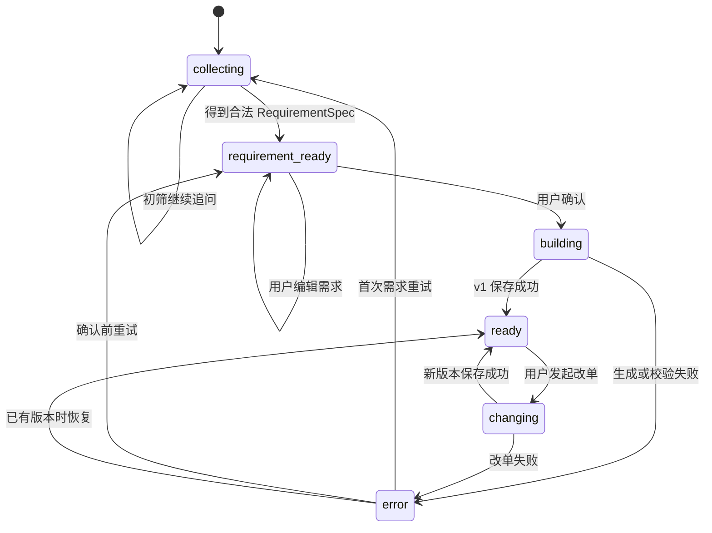

# 产品API与会话状态机

> 产品 API、Web 与分享已实现。HTTP 线格式以 [OpenAPI](../api/openapi.yaml) 为准，事件细节见 [SSE 协议](../api/SSE事件协议.md)，当前缺口见[路线图](../product/路线图.md)。

## 1. 目标与非目标

产品 API 把现有 ADK dev UI 背后的能力封装成稳定的产品后端,使 Web 客户端只理解会话、消息、需求、运行、配置版本和分享等产品对象。

产品 API 不替换 ADK、不改变 A2A 单跳、不改变四份核心 schema,也不把 buildsvc 合回单进程。cmd/host 继续承担开发调试入口;cmd/api 是新增的产品入口。

## 2. 进程与包边界

| 进程 | 默认地址 | 职责 |
|---|---|---|
| cmd/host | :8080 | ADK dev UI 与历史回归入口 |
| cmd/buildsvc | :8081 | A2A 生成 + 校验远程服务 |
| cmd/api | :8082 | 产品 HTTP API、匿名会话、后台 run、SSE 和读模型 |
| Next.js | :3000 | 展示、交互、同源代理与分享图 |

host 当前在 main 中完成模型、初筛 Agent、remote agent 和 Redis 的装配。实施时先把这部分抽成可复用 runtime factory,由 cmd/host 和 cmd/api 传入不同启动适配器。必须保持:

- 初筛模型、提示词和品牌纠偏逻辑只有一份。
- A2A Client 的 10 分钟超时只有一份。
- buildsvc URL、百炼配置和 Redis session service 的解释一致。
- cmd/host 现有命令与 A2A/Redis 回归行为不变。

产品 API 的包建议分为三层:

- transport:HTTP、cookie、SSE、problem+json。
- application:会话状态机、run 调度、所有权和幂等。
- presenter:配置版本、diff、Markdown 与公开分享读模型。

transport 不直接拼 SQL,application 不直接写 HTTP,Presenter 不依赖 ADK/LLM。

## 3. 产品状态模型

### 3.1 会话状态

状态语义:

| 状态 | 可接受的用户动作 | 禁止动作 |
|---|---|---|
| collecting | 发送自然语言、查看历史 | 确认需求、改单 |
| requirement_ready | 编辑/确认需求、补充自然语言 | 直接访问不存在的 build |
| building | 查看进度、离开页面 | 再次确认、发送新消息 |
| ready | 发送改单、查看版本、导出、分享 | 修改旧版本 |
| changing | 查看进度、离开页面 | 并发改单 |
| error | 查看错误、按建议重试 | 无幂等保护的自动重试 |

会话 phase 是产品层真值,存 PostgreSQL;ADK session state 是运行时上下文,存 Redis。不得用前端猜测 phase。

当前会话需求另由 `requirement_state` 保存，Session 的 `requirement_status` 区分收集中、待确认、已确认和确认后修改。它根据有效需求与已确认快照计算，不能拿 revision 变化代替有效需求变化。字段来源、增量编辑、未知与撤销的契约见[动态需求状态栏](动态需求状态栏.md)。

### 3.2 首次需求确认

首次对话与当前 sequential host 的差异是增加显式停顿:

1. API 只运行初筛 Agent。具有需求状态的新会话注入当前有效状态与本轮用户原文，复用 Screening 单次调用输出字段操作。
2. 服务端核验本轮来源并归并操作，保存 `requirement_state`；缺失必要字段时生成针对性追问，phase 保持 collecting。
3. 字段充足时确定性投影为 RequirementSpec，写入 pending_requirement，phase 变为 requirement_ready；先发 requirement.updated，再发 requirement.ready。
4. PATCH requirement-state 接受带 expected_revision 的字段操作，与聊天走同一 reducer，返回完整 Session。旧 PATCH requirement 完整替换入口保留兼容。
5. confirm 从数据库读取 pending_requirement，并冻结 confirmed_requirement、confirmed_requirement_state 和 confirmed_at，随后调用 A2A remote 生成配置。

UI 编辑不改变 RequirementSpec schema。existing_parts 仍按现有品类枚举处理;不能借前端表单偷偷扩展为 SKU 对象。

### 3.3 后续改单

具有需求状态的会话在 ready 后继续将用户修改归并为新草稿；原确认快照与配置版本保持不变，用户再次确认后生成新版本。仅讨论备选、无有效修改时仍显示原需求已确认。旧会话未迁移推断偏好，保留原 ChangeRequest 初筛与 A2A 链路。快捷按钮仍只预填自然语言，服务端没有 card-change 专用业务入口。

如果 Redis 中 A2A context/build_state 已过期:

- API 返回可识别的 context_expired problem。
- UI 提供「按当前需求整单重生成」,不自动假装为增量改单。
- 重生成产生新根版本还是当前树的子版本,在真正实现恢复功能前固定为新根会话,避免伪造锁定保证。

当前默认把 REDIS_SESSION_TTL 调整建议写为 720h,但不把延长 TTL 当作永久恢复方案。

## 4. 产品数据模型

新增编号迁移,不修改四份核心消息 schema。

### 4.1 web_sessions

| 列 | 类型 | 约束/用途 |
|---|---|---|
| id | text | PK;同时作为新 Web builds 的 session_id |
| owner_id | text | 匿名 cookie 对应主体;建索引 |
| title | text | 首条用户消息截取生成,不调用 LLM |
| phase | text | collecting/requirement_ready/building/ready/changing/error |
| pending_requirement | jsonb nullable | 严格 RequirementSpec 原文 |
| requirement_state | jsonb nullable | 当前会话有效字段、未知/撤销/冲突、来源和修订历史；旧会话保持 NULL |
| confirmed_requirement_state | jsonb nullable | 最近一次明确确认时的需求状态快照 |
| confirmed_requirement | jsonb nullable | 最近一次明确确认的生成需求，不被后续草稿编辑改写 |
| confirmed_at | timestamptz nullable | 最近确认时间 |
| last_error | jsonb nullable | problem 投影,成功后清除 |
| created_at/updated_at | timestamptz | DB 默认时间 |

旧 dev UI build 不要求补 web_sessions 行。builds.session_id 暂不新增外键,避免破坏历史数据;所有 Web 查询先验证 web_sessions 的 owner_id,再查询同 session_id 的 builds。

### 4.2 web_messages

| 列 | 类型 | 约束/用途 |
|---|---|---|
| id | uuid | PK,由服务端生成 |
| session_id | text | FK web_sessions ON DELETE CASCADE |
| client_message_id | uuid nullable | 用户消息幂等键;会话内唯一 |
| role | text | user/assistant/system;system 不直接展示 |
| content | text | 只保存面向产品的文本,不保存模型推理 |
| run_id | uuid nullable | 关联产生该消息的运行 |
| created_at | timestamptz | 稳定排序 |

### 4.3 agent_runs

| 列 | 类型 | 约束/用途 |
|---|---|---|
| id | uuid | PK |
| session_id | text | FK web_sessions |
| client_request_id | uuid | 会话内唯一幂等键 |
| kind | text | screening/build/change |
| status | text | running/succeeded/failed/interrupted |
| error | jsonb nullable | problem 投影 |
| started_at/finished_at | timestamptz | 耗时与中断判断 |

用部分唯一索引保证同一 session_id 最多一行 status=running。HTTP handler 不依赖进程内 mutex 才能保证并发正确性。

### 4.4 build_shares

分享功能使用:build_id 外键、token_hash 唯一、created_at、revoked_at。数据库不保存原始 token。

## 5. 匿名身份与所有权

- cookie 名固定 pcb_anonymous_id。
- 缺失时由 Go 生成 128 bit 以上随机 ID并设置 HttpOnly、SameSite=Lax、Path=/。
- 本地 HTTP 不设置 Secure;PUBLIC_WEB_BASE_URL 为 HTTPS 时必须设置 Secure。
- owner_id 不出现在 JSON、URL、日志或分享 DTO。
- GET session/build/diff/export、PATCH requirement、confirm、message、share create/revoke 都先校验 owner。
- 不用 session_id 的不可猜性代替授权。
- public share 只凭 token 读取固定 build,不读取会话。

## 6. 长任务与 SSE

### 6.1 生命周期

消息或确认接口只负责:

1. 校验身份、phase、请求体和幂等键。
2. 事务写 user message/run,将 phase 置为 building 或 changing。
3. 启动受 10 分钟 context 约束的后台执行。
4. 返回 202 与 Run DTO。

后台执行不绑定浏览器 request context,因此页面刷新或 SSE 断开不取消 Agent。单 API 进程退出会中断 goroutine;启动时把遗留 running 标为 interrupted,不静默自动重跑。

### 6.2 事件存储

- 每个 run 使用 Redis Stream pcb:run:{run_id}:events。
- event ID 使用 Redis stream ID,直接映射 SSE id。
- 事件 TTL 24h;run 和最终消息永久保留在 PostgreSQL。
- Last-Event-ID 存在时从下一条开始重放;不存在时从第一条重放。
- Redis 不可用时可使用进程内 channel,但响应和 Session DTO 必须带 degraded=true;此模式不保证重放。

### 6.3 进度真实性

稳定阶段仅三种:

- screening:初筛 Agent 正在追问或解析。
- remote_processing:A2A 远程服务正在生成并校验;不进一步猜测内部节点。
- finalizing:解析远程结果、读取已保存版本、写产品消息。

事件转换只读取作者、partial 标记、已知状态变化和最终落库结果。工具参数、模型推理、A2A 原始 task、Redis state key 一律不透传。

## 7. 幂等、并发与失败

| 场景 | 服务端行为 | HTTP/problem |
|---|---|---|
| 重复 client_request_id,原 run 成功 | 返回同一 Run DTO | 200 |
| 重复 key,原 run 仍运行 | 返回同一 Run DTO | 202 |
| 会话已有其他活动 run | 拒绝 | 409 session_busy |
| phase 不允许当前动作 | 拒绝并返回当前 phase | 409 invalid_session_phase |
| RequirementSpec 非法 | 不修改 pending_requirement | 422 schema_validation_failed |
| buildsvc 不可达 | run 失败,phase 回退到可重试状态 | run.failed / 503 upstream_unavailable |
| 10 分钟超时 | run 失败,保留历史 | run.failed / 504 run_timeout |
| SSE 断开 | 后台继续,允许重连 | 无业务失败 |
| API 重启 | running → interrupted | 409 run_interrupted,允许新 key 重试 |

失败后 phase 回退规则固定:

- screening 失败 → collecting。
- build 失败 → requirement_ready。
- change 失败 → ready。

## 8. 配置读模型与共享 presenter

BuildView 聚合:

- build id/version/parent version/created_at/intent。
- RequirementSpec。
- 固定品类顺序的 PartLine:category、sku、品牌型号、数量、单价、小计、rationale。
- Quote:total、snapshot_date、missing。
- ValidationReport 与固定免责文本。

API 不直接复用 cmd/builds 的 main 包。实施时把 decode、diff、Markdown 渲染抽到不依赖 CLI/HTTP 的内部 presenter 包,cmd/builds 和 cmd/api 同时调用。金额继续按分计算或使用数据库精确文本。

## 9. 健康检查与配置

新增环境变量:

- API_ADDR,默认 :8082。
- PUBLIC_WEB_BASE_URL,默认 http://localhost:3000。
- WEB_ALLOWED_ORIGIN,直接跨域开发时可选;正常通过 Next rewrite 同源。
- RUN_EVENT_TTL,默认 24h。

healthz 只表示进程存活。readyz 检查 PostgreSQL、Redis 和 buildsvc agent card;任一完整依赖不可用返回 503,同时给出逐项状态。Redis 降级可以启动服务,但 readyz 必须标为 degraded 而不是全绿。

## 10. 测试与 DoD

- 状态机表驱动单测覆盖全部合法/非法转移。
- cookie 生成、安全属性和跨 owner 越权测试。
- handler 与 OpenAPI response 契约测试。
- 幂等、并发 run、失败 phase 回退测试。
- Redis Stream 重放、Last-Event-ID、TTL 和无 Redis 降级测试。
- PostgreSQL 迁移、旧 builds 共存和 owner 过滤集成测试。
- fake Agent 覆盖 requirement.ready/assistant/build 事件转换。
- 真实环境完成确认需求→v1→改单 v2,且 cmd/host 原有恢复用例继续通过。

API 路径可独立通过 curl 或契约测试验证，也需覆盖现有 Web 主流程。
