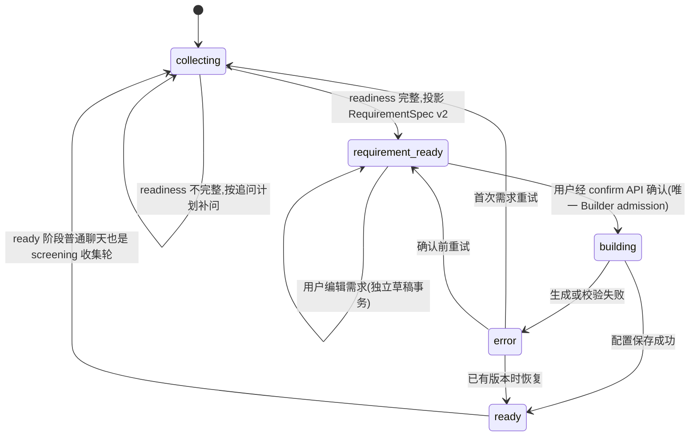

# 产品API与会话状态机

> 产品 API、Web 与分享已实现。HTTP 线格式以 [OpenAPI](../api/openapi.yaml) 为准，事件细节见 [SSE 协议](../api/SSE事件协议.md)，当前缺口见[路线图](../product/路线图.md)。

## 1. 目标与进程边界

产品 API 把初筛 Agent 与 A2A 远程调用封装成稳定的产品后端，使 Web 客户端只理解会话、消息、需求、运行、配置版本和分享等产品对象。不替换 ADK、不改变 A2A 单跳、不把 buildsvc 合回单进程。

| 进程 | 默认地址 | 职责 |
|---|---|---|
| cmd/buildsvc | :8081 | A2A 生成 + 校验远程服务 |
| cmd/api | :8082 | 产品 HTTP API、匿名会话、后台 run、SSE 和读模型 |
| Next.js | :3000 | 展示、交互、同源代理与分享图 |

包分三层：transport(HTTP、cookie、SSE、problem+json)、application(会话状态机、run 调度、所有权、幂等)、presenter(配置版本、diff、Markdown 与公开分享读模型)。transport 不直接拼 SQL，application 不直接写 HTTP，presenter 不依赖 ADK/LLM。

## 2. 会话状态机

```mermaid
stateDiagram-v2
    [*] --> collecting
    collecting --> collecting: readiness 不完整,按追问计划补问
    collecting --> requirement_ready: readiness 完整,投影 RequirementSpec v2
    requirement_ready --> requirement_ready: 用户编辑需求(独立草稿事务)
    requirement_ready --> building: 用户经 confirm API 确认(唯一 Builder admission)
    building --> ready: 配置保存成功
    building --> error: 生成或校验失败
    ready --> collecting: ready 阶段普通聊天也是 screening 收集轮
    error --> collecting: 首次需求重试
    error --> requirement_ready: 确认前重试
    error --> ready: 已有版本时恢复
```

| 状态 | 可接受的用户动作 | 禁止动作 |
|---|---|---|
| collecting | 发送自然语言、侧栏编辑草稿、查看历史 | 确认需求(readiness 未完整时硬拒绝) |
| requirement_ready | 编辑/确认需求、补充自然语言 | 直接访问不存在的 build |
| building | 查看进度、侧栏编辑草稿(不创建 run)、离开页面 | 再次确认、发送新聊天消息 |
| ready | 发送消息(screening 收集轮)、查看版本、导出、分享 | 修改旧版本;聊天直达生成 |
| error | 查看错误、按建议重试 | 无幂等保护的自动重试 |

会话 phase 是执行恢复用的粗粒度真值，存 PostgreSQL(`web_sessions`,当前确认经 `confirmation_id` 指向不可变 `requirement_confirmations` 快照,见[编号迁移](../../db/migrations/)；字段细节以迁移为准)；UI 与 admission 使用的三轴状态(requirement_readiness/requirement_confirmation/build_relation)由后端从草稿投影、确认快照与 build run 派生。不得用前端猜测 phase 或状态。

### 需求确认与 Builder gate

1. API 只运行初筛 Agent；具有需求状态的新会话注入有界上下文(RequirementStatePromptView、确定性 readiness 摘要与领域下一步追问、最近一条助手回复及未解决建议、是否有配置版本、当前 capability=tower)与本轮用户原文。Screening v2 一轮合同只输出 `operations`/`observations`/`turn_signals`/`proposals`/`answer`,严格解码拒绝未知字段(含 `next_action`/`reply`,legacy 传输适配已删除);`has_requirement_update` 由 operations/observations 派生,模型不输出。
2. 服务端核验本轮来源并归并操作，保存 `requirement_state`;确定性 readiness 判定不完整时按领域追问计划(`NextRequirementQuestion`,每轮一个问题组,conflict/unsupported 优先)生成针对性追问，phase 保持 collecting。
3. readiness 完整时确定性投影为 RequirementSpec v2(含 configuration_scope=[tower] 与来源可追溯的系统默认),写入 pending_requirement，phase 变 requirement_ready;先发 requirement.updated，再发 requirement.ready。
3a. 回复由产品层确定性组合(展示守卫后的 answer → 展示建议问句 → 追问或就绪提示),并按 readiness+turn signals 发布短期 presentation action(`presentation.action` 事件:open_requirement_review / focus_missing_requirement),不启动 Builder;确认/生成三轴 Policy 在同一入口扩展。模型 answer 声称已开始生成或承诺主机外品类时,被确定性守卫替换为诚实范围说明。
3b. 助手建议(proposal)只在建议问句确实展示给用户后与 assistant 消息同事务保存(迁移 00022 `requirement_proposals`),绑定真实 assistant message id,只对紧接着的下一条用户消息有效;用户明确接受时 operation 携带 `evidence=accepted_proposal`,服务器核验同字段同规范化值、消息归属与紧邻轮次后才进入 Reducer,接受后建议 resolved,拒绝/覆盖/跨轮不得复用。
4. `PATCH requirement-state` 是独立原子草稿编辑事务:复用同一 Reducer、权限与幂等约束,只更新草稿 RequirementState 与 revision,不创建 AgentRun、不改变 phase;**Builder 运行期间同样可用**(运行中的 Builder 只读取启动时冻结的快照)。旧 PATCH requirement 完整替换入口保留兼容。
5. `POST requirement/confirm` 是唯一的 Builder admission:请求体携带 `expected_revision` 与 `expected_review_hash`(来自服务端核定预览),可选 `retry_of_run_id`(仅失败重试)。服务端在同一事务重算 readiness、比较 revision 与 review hash、冻结不可变确认快照(`requirement_confirmations`:review_spec + review_hash + revision 等)并冻结该 run 的完整 Builder 载荷(`agent_runs.builder_input_payload` + `builder_input_hash`):载荷内 `effective_constraints` 承载冻结的有效选型约束(完整核定预览 + 默认来源),Builder 的模型输入与确定性门槛只读它,`requirement_state` 仅保留用户事实与溯源;失败重试整体继承该约束,仅替换 run 标识。然后创建唯一 build run。`RequirementState/Spec v1` 在解码边界以稳定错误拒绝,不静默迁移。
5a. 稳定 admission reason code(409/422 problem code):`requirement_revision_conflict`、`requirement_review_conflict`(revision 不变但默认规则/配置范围变化导致预览失效)、`session_busy`(活动 Builder 存在)、`invalid_retry_target`、`requirement_not_ready`。

### 三轴状态(Readiness / Confirmation / Build)

Session DTO 由后端唯一计算三轴,前端只渲染:`requirement_readiness`(status/missing_fields/blocking_conflicts/unsupported_capabilities/next_question/confirmation_eligible/effective_defaults)、`review_spec`/`review_hash`(核定预览,展开有效系统默认)、`effective_budget_ceiling_cny`(budget_cny×(1+budget_flex) 展示值)、`requirement_confirmation`(unconfirmed/confirmed/modified + confirmed_revision/confirmed_at/confirmed_review_hash)、`build_relation`(none/running/current/outdated/failed + version/snapshot_id/review_hash/builder_input_hash)。旧的单值 `requirement_status` 与裸 `missing_fields` 已删除。

- confirmed=当前草稿规范化 review_hash 与最近确认快照相同;modified=存在快照但草稿不同或已不足以投影。
- running 优先表示活动 Builder;草稿运行中修改 → confirmation 立即 modified,run 结束后按当时草稿与该 run 的快照计算 current/outdated/failed。outdated 仅在已有成功配置时成立;failed 可与 modified 并存,历史成功配置经 version 继续可见。
- 草稿改回与快照完全相同的规范化 review_spec 时自动恢复 confirmed/current;不强迫重复确认,已有 run 的冻结载荷不随之改变。

ready 后继续将用户修改归并为新草稿；原确认快照与配置版本不变，再次确认(生成新快照与新 run)后生成新版本。生成期间(确认/生成 CTA 禁用)聊天与侧栏编辑可用,但第二次确认被服务端硬拒绝;第一版不排队、不并行、不自动取消。Redis 中 A2A context/build_state 过期时返回可识别的 context_expired problem,UI 提供「按当前需求整单重生成」，重生成固定为新根会话——它同样必须走 confirm API,不得绕过唯一 admission。

## 3. 匿名身份与所有权

- cookie 名固定 `pcb_anonymous_id`;缺失时 Go 生成 128 bit 以上随机 ID 并设置 HttpOnly、SameSite=Lax。本地 HTTP 不设 Secure;`PUBLIC_WEB_BASE_URL` 为 HTTPS 时必须设置。
- owner_id 不出现在 JSON、URL、日志或分享 DTO。所有会话级操作先校验 owner;不用 session_id 的不可猜性代替授权。
- 会话管理：`PATCH /sessions/{id}` 接受 `title`(1-80 字符)与 `archived`;`DELETE /sessions/{id}` 在确认无运行中任务后，事务清理版本、分享、需求、消息、运行与反馈，返回 204。归档只影响列表分类。可选账号系统见[技术选型 ADR-008](技术选型.md)。

## 4. 长任务与 SSE

消息或确认接口只负责：校验身份/phase/请求体/幂等键 → 事务写 user message/run、置 phase → 启动受 10 分钟上下文约束的后台执行 → 返回 202 与 Run DTO。后台执行不绑定浏览器 request context,页面刷新或 SSE 断开不取消 Agent;单 API 进程退出把遗留 running 标为 interrupted，不静默自动重跑。

- 事件存储：每个 run 使用 Redis Stream `pcb:run:{run_id}:events`，事件 ID 直接映射 SSE id;TTL 24h,run 和最终消息永久保留在 PostgreSQL;Last-Event-ID 存在时从下一条开始重放。Redis 不可用时使用进程内 channel，但响应必须带 degraded=true 且不保证重放。
- 进度真实性：稳定阶段仅 screening / remote_processing / finalizing 三种；事件转换只读取作者、partial 标记、已知状态变化和最终落库结果，工具参数、模型推理、A2A 原始 task 一律不透传。
- run 生命周期(F1):`POST /sessions/{id}/runs/{run_id}/cancel` 返回 202，取消置位 `cancel_requested_at` 并触发本地取消(取消 ≠ 失败);`ReclaimStaleRuns` 回收过期 running 行。`agent_runs` 记录 kind/status/error、取消与超时列、模型身份与计量(F3)、catalog_snapshot_id;部分唯一索引保证同一会话最多一行 running。

### 幂等、并发与失败

| 场景 | 服务端行为 | HTTP/problem |
|---|---|---|
| 重复 client_request_id,原 run 成功 | 返回同一 Run DTO | 200 |
| 重复 key,原 run 仍运行 | 返回同一 Run DTO | 202 |
| 会话已有其他活动 run | 拒绝 | 409 session_busy |
| phase 不允许当前动作 | 拒绝并返回当前 phase | 409 invalid_session_phase |
| RequirementSpec 非法 | 不修改 pending_requirement | 422 schema_validation_failed |
| buildsvc 不可达 | run 失败，phase 回退 | 503 upstream_unavailable |
| 10 分钟超时 | run 失败，保留历史 | 504 run_timeout |
| SSE 断开 | 后台继续，允许重连 | 无业务失败 |
| API 重启 | running → interrupted | 409 run_interrupted |

失败后 phase 回退：screening 失败 → collecting;build 失败 → requirement_ready。失败重试区分两类:同幂等键同请求重放返回原 run;失败后的新生成必须显式携带 `retry_of_run_id` 走 confirm API——复用确认快照,选型上下文(需求状态、基线草稿、上一提案)整体继承目标 run 的冻结载荷,仅替换本轮 run 标识并另冻新载荷/hash,不从当前 session 重新组装;草稿已修改则先重新核定。错误恢复不自动退回旧 confirmed spec 启动生成;`RunChange`、确定性改单与 `ChangeRequest` 旁路已删除,不存在绕过唯一 confirm admission 的路径。

## 5. 配置读模型与 presenter

BuildView 聚合 build id/version/parent/intent、RequirementSpec、固定品类顺序 PartLine(category、sku、品牌型号、数量、单价、小计、rationale)、Quote(total、snapshot_date、missing)与 ValidationReport。`internal/presenter` 承担 builds JSONB 解码、金额、版本树、diff 和 Markdown 渲染，`cmd/builds` 和 `cmd/api` 共同调用，前端不重算总价、预算差或兼容性。金额按分或数据库精确文本计算。

## 6. 分享与导出

分享只暴露已保存的不可变 build 版本，不共享会话；不泄露匿名身份、session、聊天、run 和 Agent 内部数据。支持 Markdown 下载、可撤销只读链接和 1200×630 PNG 分享图；不做协作编辑、评论、短链接、访问统计或公网发布。实现与测试不调用大模型。

- 接口:`POST/GET /api/v1/sessions/{sid}/builds/{version}/shares`、`DELETE .../shares/{share_id}`、`DELETE /api/v1/shares/{token}`、`GET /api/v1/public/shares/{token}`、`GET .../export.md`。创建在事务内锁定并验证所属；同幂等键重试返回原分享与 200;撤销是软删除。不存在、越权、非法 token 和已撤销的公开读取统一 404,避免枚举差异。
- **token 策略**:`SHARE_TOKEN_SECRET` 独立 base64url 密钥(≥32 字节)；token 用带版本前缀的 HMAC-SHA256 派生，输入包含 owner、session/build 版本和 Idempotency-Key——同一 build 与同一幂等键在 API 重启后仍能重建相同 token;数据库仅保存 SHA-256 哈希，泄露不直接暴露可用 URL。
- **PublicBuildView 最小披露**：只含版本/时间/改单摘要、需求偏好摘要、八品类配件、总价/预算差/快照日期/12 条校验/三条免责；明确排除 RequirementSpec notes/observed、owner/session/run 内部 ID、聊天历史、A2A 内部事件和错误堆栈，泄露黑名单测试防重构扩大公开面。
- 公开页 `/share/[token]` 是 Server Component,服务端读取 public API,不转发 Cookie;统一 404 不展示 Problem detail。公开 JSON、Markdown、SSR 页和 PNG 全部 `Cache-Control: no-store`;设置 `Referrer-Policy: no-referrer` 和 `X-Robots-Tag: noindex`。PNG 用 `ImageResponse`,中文字体从本地 OFL 授权包加载，不请求第三方字体。
- Markdown 导出复用 presenter,文件名 `pc-build-v{version}-{snapshot_date}.md`,不含 token、session 或内部 ID。正式公网发布前仍需同源 HTTPS、Secure Cookie、限流、日志脱敏和反向代理检查。

## 7. 健康检查与配置

环境变量:`API_ADDR`(默认 :8082)、`PUBLIC_WEB_BASE_URL`、`WEB_ALLOWED_ORIGIN`(跨域开发可选)、`RUN_EVENT_TTL`(默认 24h)、`SHARE_TOKEN_SECRET`、`AUTH_SESSION_SECRET`。healthz 只表示进程存活；readyz 检查 PostgreSQL、Redis 和 buildsvc agent card,任一完整依赖不可用返回 503,Redis 降级启动但 readyz 标 degraded。
