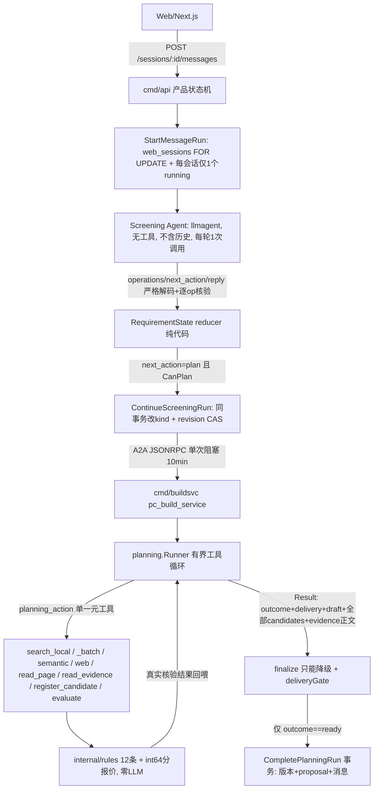

# 多 Agent 运行时审计与修复方案

> 更新：2026-09-21。本文是一次只读审计的结论交接，供后续执行者（人或模型）按项实施修复。
> 文档记录"已确认的现状 + 待执行的改造"，不代表任何一项已完成；实现后的当前缺口仍只在
> [路线图](../product/路线图.md) 维护，本文不长期充当执行依据。
>
> 使用方式：按 §5 的阶段顺序执行，一个修复项一个提交。§2 是代码地图（位置已经人工复核），
> §3 是不得破坏的不变量，§6 是仍需实测的存疑点。所有 `文件:行` 以 2026-09-21 的工作副本为准，
> 动手前先跳转确认一次。

---

## 1. 背景：当前真实运行形态

产品默认 `BUILD_HARNESS_MODE=planning`（`.env.example:36`、`cmd/buildsvc/main.go:92-100`）。
真实的 Agent 数量是 **2 个 LLM Agent + 若干确定性节点**，没有 Manager、没有 spawn、没有 handoff 图，
控制流由产品状态机写死。



三条执行线的可达性（重要，很多旧文档叙述不一致）：

| 模式 | 装配入口 | 产品 HTTP 入口下是否可用 |
|---|---|---|
| planning | `internal/agents/pipeline/planning.go:19` | 可用（唯一可用路径） |
| v2 Harness | `internal/agents/pipeline/harness_v2.go:23` | 不可用：产品恒发 `PlanningInput{schema_version:2}`（`internal/product/planning.go:53-55`），v2 只解 RequirementSpec，`harness_v2.go:85-88` 直接报错 |
| legacy | `internal/agents/pipeline/remote.go:49`、`pipeline.go:33` | 不可用：`validator.go:65-69,167-172` 遇带强度约束或已有件明确拒绝交付 |

结论：v2/legacy 只服务于 dev UI（`cmd/host`）与评估命令，是显式历史诊断路径，不是失败回退。

---

## 2. 代码地图（已人工复核）

| 位置 | 职责 |
|---|---|
| `internal/hostruntime/runtime.go:64-108` | Screening + A2A remoteAgent 共享装配（产品 API 与 dev UI 同源） |
| `internal/hostruntime/runtime.go:115-138` | `trimToPayload`：跨进程只发一条结构化载荷，剥掉对话全文；产品 owner 下 `ContextID = web session id` |
| `internal/product/service.go:151,207` | `StartMessage` → goroutine `execute` 按 run kind 分派 |
| `internal/product/service.go:201` | `context.WithTimeout(s.ctx, RunTimeout)`，`RunTimeout = 10 * time.Minute`（:24）——**父 ctx 是服务 ctx，不是请求 ctx** |
| `internal/product/service.go:510-544` | `executeRemote`：progress → planningContext → Remote 调用 → 落库；`:522` 写入 `actual_builder_model: nil, "remote_identity_unavailable"`；`:535-544` 是 `result.Planning == nil` 时的"版本行是否新增"启发式 |
| `internal/product/planning.go:22-46,48-83,85-137` | 聊天续跑、执行输入组装、`completePlanning`（仅 `outcome=="ready"` 构造版本参数） |
| `internal/product/agent.go:193-200,256` | `Remote()` 阻塞式收事件；`ev.Partial` 被显式丢弃 |
| `internal/store/product.go:335,366,437,505,620` | `FOR UPDATE`、`ErrSessionBusy`、`agent_runs_one_running_per_session_idx` 判定、`RecoverInterrupted` 的 `status='running' FOR UPDATE` |
| `internal/store/planning_continuation.go:15-27` | 同事务把 run 由 screening 改 build/change + revision 校验 |
| `db/migrations/00005*.sql:21-36` | `agent_runs` 列集（**无 model/token/工具计数列**）、单 running 部分唯一索引 |
| `db/migrations/00004_p4_requirements_builds.sql:13-25` | `builds` 列集（**无 run_id、无 catalog_snapshot_id**） |
| `internal/agents/pipeline/planning.go:23-49` | planning 根 Agent：解析输入 → `Runner.Run` → 出错走 technical_fault 分支（:32-37） |
| `internal/agents/pipeline/planning.go:63-65` | `ReadPlanningResult`：`len(InlineData.Data) > 2*1024*1024` 直接返回 nil |
| `internal/planning/runner.go:21-42` | planning 系统提示（工具契约、额度、诚实性要求） |
| `internal/planning/runner.go:159-176,180-182,336` | 单一 `planning_action` 元工具；`turns` 上限 8；最后一轮摘掉工具；工具计数上限 24 |
| `internal/planning/runner.go:849-1011` | `finalize()`：只降级；ready 需 pass + 有报价 + 零 residual issue + 每个 active must 有 `met` 且引用真实存在的证据 id（:902-945）+ 非空候选（:947）；`:1003-1010` 写 `delivery.status` |
| `internal/planning/gates.go:345-385` | `deliveryGate`：预算/unknown/must/自纠/停滞五门，受 `turn >= turns-2 || gates.total >= 3` 限制 |
| `internal/planning/evidence.go:13-19` | `evidencePreview`：正文超 240 rune 截断为预览（仅用于回喂上一轮 proposal 的输入侧） |
| `internal/planning/web.go:129-157` | 每次搜索先 `ReserveSearch` 再请求；失败不退还；`:148-150` 把任何预留错误都表述成"额度已用完或无法核验" |
| `internal/evalmetrics/metrics.go:42,53` | `P10_METRICS_DIR` 未设置即整体 no-op；`.env`/`.env.example`/compose 均未设置 → 生产路径无 token 指标 |
| `internal/agents/pipeline/screening_requirement_state.go:38-130` | 产品增量协议：`operations/next_action/reply`、逐 op 核验、quote 必须是本轮原文子串；`:105-107` 解码失败即失败（无格式重试） |
| `internal/schemas/requirement_state.go:576-605` | `RequirementStatePromptView`：只送当前值/墓碑/未解决观察，但**总条数与总字节无上限** |

---

## 3. 不得破坏的不变量

1. **`Agent completed ≠ Task succeeded`**：`model_outcome` 是模型意图，`outcome` 是服务端判定，
   `delivery.status ∈ not_applicable|unresolved|eligible|delivered|stale`。任何改造只能保持或加强这个分离，
   不得为提升成功率把 unknown/缺价当通过。
2. **`internal/rules` 零 LLM**（depguard 保护，`.golangci.yml`、`CLAUDE.md:52`）；价格用 int64 分，缺数据输出 unknown。
3. **交付真值 = 数据库新增版本行**，不是模型自述；`build_version` 只在事务成功后发布事件。
4. **单会话同一时刻只有一个 running run**；幂等靠 `client_request_id`、`session_proposals.run_id UNIQUE`、
   `UNIQUE(session_id, version)`；需求修订变化时保存 stale 而**不**生成版本。
5. **跨进程只传结构化载荷**，不传对话全文与自然语言转述；修复循环留在生成服务内（`docs/tech/A2A服务边界.md`）。
6. **证据溯源**：数值必须出现在被引用的正文摘录中；`register_candidate` 只写会话快照，不写全局目录。
7. **模型纪律**：启动与离线测试不得探测模型；真实调用只走显式 `modelcheck` 或带门禁的 Live 测试；
   额度链不得静默跨供应商回退；日志与指标不得含密钥、Cookie、Token 或需求全文（`CLAUDE.md:47,49`）。
8. **提示词只作软约束**，任何硬约束必须有代码检查（本次多数修复项正是把 prompt 语义补成 Runtime 语义）。

---

## 4. 修复项

优先级：F1/F2/F3 为 P0-P1（必修），F4/F9 为 P1-P2（低成本），F5/F6/F7 为 P1（架构层），F8 为 P2（收敛）。

### F1 run 不可取消，且会把会话锁死 10 分钟（P0）

- **问题**：超时 ctx 派生自服务 ctx（`internal/product/service.go:201`）；无 cancel 端点；A2A 是一次阻塞调用且
  partial 事件被丢弃（`internal/product/agent.go:256`）；客户端断连不影响模型循环；每会话仅一个 running
  （`db/migrations/00005*.sql:34`、`internal/store/product.go:437`）→ 用户离开页面后只能等 10 分钟才能再发；
  进程被强杀则留下永久 `running` 行（`RecoverInterrupted` 只在启动与 Shutdown 调用）。
- **危险性**：真实额度浪费 + 会话不可用 + 状态不可信，是三者中唯一直接可见的故障。
- **改造**：
  1. 迁移 `000xx_run_lifecycle.sql`：`agent_runs` 增加 `cancel_requested_at TIMESTAMPTZ`、`expires_at TIMESTAMPTZ`
     （写入时 = `started_at + RunTimeout`）。
  2. Store：`RequestRunCancel(ctx, ownerID, runID)`（仅 `status='running'` 可置位）、
     `ReclaimStaleRuns(ctx, now)`（把已 `cancel_requested_at` 或 `expires_at < now()` 的 running 落 `interrupted`）。
  3. Service：per-run ctx 改为 `context.WithTimeout(context.WithoutCancel(s.ctx), RunTimeout)`，并注册
     `runID → cancelFunc`（`sync.Map`）；cancel 端点触发本地 cancel 并置位 DB 标志；`execute` 结束后注销。
     落库路径继续用 `context.WithoutCancel`（现有 `:294,565,643` 已如此），保证取消后 partial 进度仍可保存。
  4. HTTP + 契约：`POST /api/v1/sessions/{id}/runs/{run_id}/cancel` → 202；同步 `docs/api/openapi.yaml`
     与 `docs/api/SSE事件协议.md`（新增 `run.cancelled`）。
  5. Web：会话忙时提供"停止本次生成"；收到取消事件后立即放开输入。
  6. 回收触发：`ReclaimStaleRuns` 在启动时 + 每次 `StartMessageRun` 前调用同一会话的过期行（避免引入定时任务；
     项目不使用本机定时任务，见 `docs/tech/开发约定.md`）。
- **注意**：取消不应被记成 `technical_fault`。`internal/agents/pipeline/planning.go:32-37` 目前在 `err != nil`
  时覆盖 Reply/Issues；若 ctx 取消导致 Runner 返回 err 且 `x.finish()` 已带可用 draft，应保留可保存的 proposal
  而不是中断文案（见 §6-2）。
- **验收**：`internal/producthttp` 新增测试（fake gateway 阻塞 → cancel → run 终态为 `interrupted`/`failed` 且
  新消息不再 `ErrSessionBusy`）；`ReclaimStaleRuns` 单测；`go test ./internal/store ./internal/product ./internal/producthttp`。
- **成本**：中（1 迁移 + 约 80-120 行 + 前端小改）。

### F2 Data Plane 走消息：MB 级产物过 JSON-RPC，超限静默变"生成失败"（P0）

- **问题**：`planning.Result` 携带全量 `Candidates`（含 specs）与 `Evidence.Text`（读窗 16000 rune，单页 ≤2 MiB），
  整体序列化进一个 A2A data part；`ReadPlanningResult` 对 >2 MiB **返回 nil**（`internal/agents/pipeline/planning.go:63-65`），
  随后 `internal/product/service.go:535-544` 退化为"版本行是否新增"的启发式，产出无信息量的失败原因。
- **危险性**：控制面与数据面混用；同一份数据双写（消息 + JSONB）；恰恰是最需要诊断信息的大结果场景丢失全部结构化原因。
- **改造（分两步，先做第一步即可消除故障）**：
  1. **第一步（最小）**：返回前把传输用的 `Evidence.Text` 降为 240 rune 预览（直接复用
     `internal/planning/evidence.go:13` 的 `evidencePreview` 语义），`Candidate.FieldQuotes` 长值同样截断；
     完整正文由 buildsvc 落 PG（它已持有 `cfg.Store`），走新表 `planning_artifacts(run_id TEXT PRIMARY KEY, payload JSONB)`
     或复用 `run_evidence` 之外的独立槽位（**不要**复用 `db/migrations/00012` 的四槽位，那是首写冻结的反馈证据）。
     Result 保留 `evidence[].id/url/captured_at/kind/read_bytes` 与预览，正文按需从 PG 展开。
  2. **第二步（架构）**：A2A 只回 control plane：`{run_id, outcome, model_outcome, delivery, issues, reply,
     draft, quote, validation, version?}`；产品侧需要完整 result 时按 `run_id` 读回（同 PG，不新增网络跳）。
  3. **同时**把 `service.go:535-544` 的 nil-result 分支改为显式失败 Problem（含 run_id、payload 字节数、
     "结果超出传输限制已降级保存"这类可诊断文案），彻底移除"以版本行数量当作验收"的路径。
- **约束**：不得改变 `finalize` 的判定输入（正文降级不能影响 must 证据存在性检查 `runner.go:927-945`——
  检查依赖 `Evidence.ID` 与 `Kind`，不依赖全文）。
- **验收**：构造超长正文 fake 页面的 planning 回归测试，断言 result 不被丢弃、`outcome/delivery.status/issues`
  完整、DB 能取回全文；断言 `session_proposals.result` 体积有界。
- **成本**：中。

### F3 生产路径几乎不可观测（P1）

- **问题**：`P10_METRICS_DIR` 未设置 → 指标包装整体 no-op（`internal/evalmetrics/metrics.go:42`、
  `internal/modelprovider/factory.go:39`）；`agent_runs` 无 model/token 列、`builds` 无 run_id 列；
  `service.go:522` 把 builder 模型身份写成 nil 占位；run 事件只存 Redis（24h TTL，`RUN_EVENT_TTL`）无 PG 镜像；
  跨进程无 trace/span id；`NewProblem(..., r.ID)` 把 run_id 塞进 `request_id`，日志与 DB 对不齐。
- **危险性**：无法回答"v_n 是哪个模型、多少 token、几次工具、哪次快照"；且 F1/F2/F7 的收益无法度量。
- **改造**：
  1. 迁移：`agent_runs` 增加 `screening_model TEXT, builder_model TEXT, model_calls INT, tool_calls INT,
     search_calls INT, page_calls INT, tokens INT, duration_ms BIGINT, catalog_snapshot_id BIGINT, retry_count INT`；
     `builds` 增加 `run_id UUID, catalog_snapshot_id BIGINT`（历史行留 NULL，不回填、不批量改写）。
  2. buildsvc 在 control plane 回传自身 builder 标识（provider/role/model，来自 `modelprovider`，
     **不要**回传部署密钥或需求全文）；产品侧填入真实值，删除 `remote_identity_unavailable` 占位。
  3. 指标字段名沿用现有 `planning.Result` 计量口径（`model_calls/tool_calls/search_calls/search_requests/
     page_calls/tokens/duration_ms/stage_ms`），不新造同义字段。
  4. 终态事件镜像进 PG（`run.completed/run.failed/build.saved/requirement.ready` 四类即可），
     让 24h 之后仍可重建时间线；SSE 热路径仍走 Redis。
  5. 修正 Problem 的 `request_id` 语义：HTTP 请求 id 归 request_id，run id 单列。
  6. Web 端：把 `Result.StageMS/ModelCalls/ToolCalls/Tokens` 展示在运行详情（已有 stage 映射，
     见 `web/src/components/session-workspace.tsx`）；顺手清理前端白名单里后端从不发射的
     `assistant.delta`（`web/src/lib/api/sse.ts:47`）。
- **验收**：一次 planning run 后单条 SQL 能答出 F3-1 列的全部值；`go test ./internal/store ./internal/producthttp`
  （需 `PG_TEST_DSN`）。

### F4 增量协议输出非法即整轮失败，无格式重试（P1）

- **现状**：旧协议有 1 次格式重试（`internal/agents/pipeline/screening_guard.go:66`），增量协议没有
  （`screening_requirement_state.go:105-107` → `service.go:598-602` 422 `generation_failed`）。
  用户看到的是"原有需求保持不变，可重试"，但需自己重发，且叠加 F1 的会话锁。
- **改造**：在 `screeningGuard` 的增量分支对"严格解码失败"增加**至多 1 次**同模型重请求（沿用现有"仅无 JSON"
  重试范式与 `collectFallbackInstruction` 的写法），第二次仍失败才失败；`retry_count` 随 F3 入库。
- **禁止**：不得因重试切换模型候选；不得放宽逐 op 核验（quote 子串、幻觉已有件拦截、`budget_flex` 依据检查）。
- **成本**：低。

### F5 落库侧不复算核验，核验所用快照身份未持久（P1）

- **现状**：兼容与报价只在 buildsvc 内存算一次，产品直接把回来的 `Validation/Quote` 写库
  （`internal/product/planning.go:109-112`），`SaveBuildVersion` 只校验字段非空；run 内使用的目录快照 id
  （`internal/planning/runner.go:87-93`）不入库。若 run 期间发布新价格快照，旧核验仍会作为新版本落库。
- **改造**：`completePlanning` 在 `outcome=="ready"` 时，用产品自己的 store 重放一次 `validate.Node`
  （`internal/agents/validate`，零 LLM），比对 `OverallStatus`、总价、候选集合与目录快照 id；
  不一致则降级为 proposal 并附 issue"服务端复验与生成侧结论不一致"，**不**新增版本。
  `catalog_snapshot_id` 与 `run_id` 随 F3 写入 `builds`。
- **禁止**：不要用模型复验；复验不得修改 draft 或补造字段。
- **成本**：低-中（同库重放，一次查询）。

### F6 取消是否级联到 buildsvc（P1，依赖实测）

- **待实测**：`a2asrv.NewHandler(executor)`（`cmd/buildsvc/main.go:137-138`）是否把 `r.Context()` 传入 ADK runner。
  若不传播，客户端超时/取消后 buildsvc 仍会跑满 8×24 额度。
- **改造（按实测结果二选一）**：优先在 `planning.Runner` 增加注入点 `ShouldCancel func() bool`，
  buildsvc 每轮开头检查一次（读 `agent_runs.cancel_requested_at` 或共享 Redis 键）；
  仅当确认 ctx 传播可用时，才只做 ctx 传递。
- **成本**：中。

### F7 额度与成本无硬预算（P1）

- **现状**：`Result.Tokens` 只累计不比较；无全局/每日预算；搜索额度预留失败不退还
  （`internal/planning/web.go:148-157`），`/account.json` 本身是计费请求却不在预留内；
  预留谓词用的是滞后的 provider usage（`internal/store/proposals.go:24-25` 注释已承认）。
- **改造**：
  1. 搜索额度改为"请求成功后 settle"，失败按结果退还或标记为未知消耗；`account.json` 纳入计量口径；
     PG 故障与额度耗尽区分文案。
  2. 新增 `RUN_TOKEN_BUDGET`（默认 0 = 不限）与 `DAILY_TOKEN_BUDGET`，由 planning 循环与产品侧共同硬限：
     超阈值时停止联网工具、进入整理轮并保留 proposal。
  3. 预算值只进 `.env.example` 与文档，不在 prompt 里请求模型"省着用"。
- **成本**：中。

### F8 死执行线的收敛（P2）

- **现状**：v2 在产品路径硬错、legacy 明确拒交付（见 §1 表）；两者仍是 `BUILD_HARNESS_MODE` 合法值，
  README 与 `docs/tech/A2A服务边界.md`、`docs/tech/流水线与工具调用.md` 仍以旧三角色叙述为主线。
- **改造**：**不删代码**（评估资产与历史基线依赖 `internal/buildharness`）。只做：
  1. `README.md:21-31` 架构图更新为 planning 真实形态（2 LLM Agent + 零 LLM 校验 + 有界工具循环）。
  2. `cmd/buildsvc` 启动日志显式标注"产品入口仅支持 planning；v2/legacy 仅供 dev UI 与评估"。
  3. 已知缺陷留档（不修）：v2 的 schema 错分支把 `previous` 置 nil 后同轮跳过 mutable 约束
     （`internal/buildharness/harness.go:126-131,151-156`）、预算修复轮要求模型逐字照抄代码枚举结果
     （`harness.go:265-273`）——均属诊断路径，记入本文与路线图即可。

### F9 需求状态视图无上限（P2）

- **现状**：`RequirementStatePromptView`（`internal/schemas/requirement_state.go:576-605`）已过滤为当前值 +
  未解决观察，但字段总条数（含 `free.*`）、observations、alternatives 均无总量上限；每轮 ≤32 ops
  （`schemas/requirement_state.go:127,142,269-287`）只限增量，不限存量。
- **改造**：给视图加总字节与总条数上限（超限按活跃度与来源强度裁剪，并在 payload 里显式声明
  "历史观察未完整展开，可用面板查看"），**不得**把被裁剪的内容静默当作不存在。
  另建议 `.gitignore` 补 `var/`（当前未被跟踪但也没有忽略规则）。
- **成本**：低。

---

## 5. 执行阶段

| 阶段 | 内容 | 依赖 |
|---|---|---|
| Phase 0 | 先取基线：用现有评估口径跑一轮 planning 批量，记录成功率/token/耗时/取消不可用导致的重试次数 | — |
| Phase 1 | F1、F2（第一步）、F3、F4、F9 | 互不依赖，可并行；F3 的列迁移与 F1/F2 同一迁移批次更省 |
| Phase 2 | F5、F6（需 §6-1 实测结论）、F2 第二步 | F1 的取消标志通道、F3 的快照 id 入库 |
| Phase 3 | F7、F8（装配与文档收敛）、恢复每阶段后的文档回填 | F3 指标可用后才谈得上预算调参 |

修复前后必须用同一用例集与同一固定模型对比（`CLAUDE.md:56-60` 的评估口径），不得混用模型链结果。

---

## 6. 仍需实测或复核的点（不要当作已确认事实）

1. **a2asrv 是否传播请求 ctx**（决定 F6 形态）。最小验证：buildsvc 侧打一行 `ctx.Done()` 观察，
   或用 fake builder model 让客户端提前 cancel/timeout，看服务端调用是否停止。
2. **取消与 technical_fault 的交互**：`internal/agents/pipeline/planning.go:32-37` 在 `Runner.Run` 返回 err 时
   会覆盖 Reply/Issues 为中断文案；F1 需决定取消是否保留可保存的 partial proposal。
3. **`planning.Result` 的精确 JSON 字段名**：`ModelOutcome/Outcome/Delivery` 位于 `internal/planning/types.go`
   （约 :31-35、:64-68），改传输结构前完整读一遍该文件，别照抄本文行号。
4. **`session_proposals.result` 的真实体积分布**：F2 落地前后各测一次（同 run 数、同用例集）。
5. **Redis 会话体积**：`internal/redisstore/service.go` 整段会话 JSON 序列化，F2 后正文不再回灌，应重新测量；
   若仍偏大，考虑会话事件裁剪（属新范围，先记录不实施）。
6. `internal/buildharness` 与 `internal/agents/pipeline/validator.go` 的次要分支细节来自本次审计的子调查，
   未在 F8 中要求修改；若 F5/F6 涉及该路径需再逐行确认。

---

## 7 明确不做

1. 不新增 Planner / Critic / Reviewer / Manager Agent；当前反馈已是"环境执行结果 + 代码核验"，
   再加 LLM 评审属重复采样。
2. 不把 validator 包成 Agent，不让模型持有最终交付判定权。
3. 不为提升通过率放宽 `finalize` 或交付门；unknown 不得冒充 pass。
4. 不复活 v2/legacy 作为产品回退路径，不引入自动模式切换。
5. 不引入跨供应商静默模型回退，不在启动时探测模型。
6. 不建跨会话长期偏好库（超出当前产品边界，见 `docs/product/PRD.md`）。

---

## 8. 环境与验证

```bash
go build ./... && go vet ./...
golangci-lint run                       # internal/rules 零 LLM 由 depguard 保护
go test ./...                           # 全离线
PG_TEST_DSN=... go test ./internal/producthttp -run TestPlanningProposalPersistentWorkflow -v
# 浏览器回归：TestPlanningBrowserServer + web/e2e-requirements/planning.spec.ts
# 真实模型仅显式门禁：PLANNING_LIVE=1 go test ./internal/agents/pipeline -run TestPlanningLiveBounded -v -timeout 10m
```

- 迁移：保留数据卷 `go run ./cmd/migrate up`；禁止对普通迁移执行 `down -v`（`CLAUDE.md:24`）。
- 契约同步：字段变更同步 `internal/schemas`、`docs/api/openapi.yaml`、`docs/api/SSE事件协议.md` 与契约测试。
- 文档回填：F1/F2/F3/F5/F7 落地后更新 `docs/tech/自主规划流程.md`（观测与额度章节）、
  `docs/tech/产品API与会话状态机.md`（run 生命周期）、`docs/tech/系统架构.md`（边界图）与
  `docs/product/路线图.md`（只写未完成事项与完成证据）。
- Windows：命令走 Git Bash（`C:\Program Files\Git\bin\bash.exe`）；仓库统一 LF（`.gitattributes`）；
  保留既有中文注释与编码，不做无关整文件格式改动。
